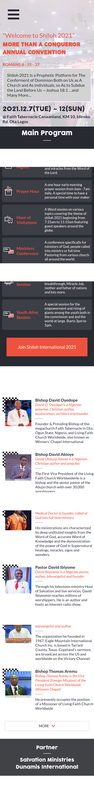
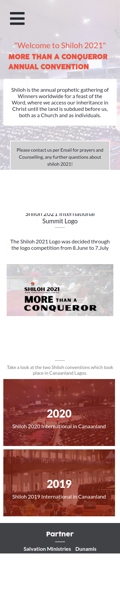
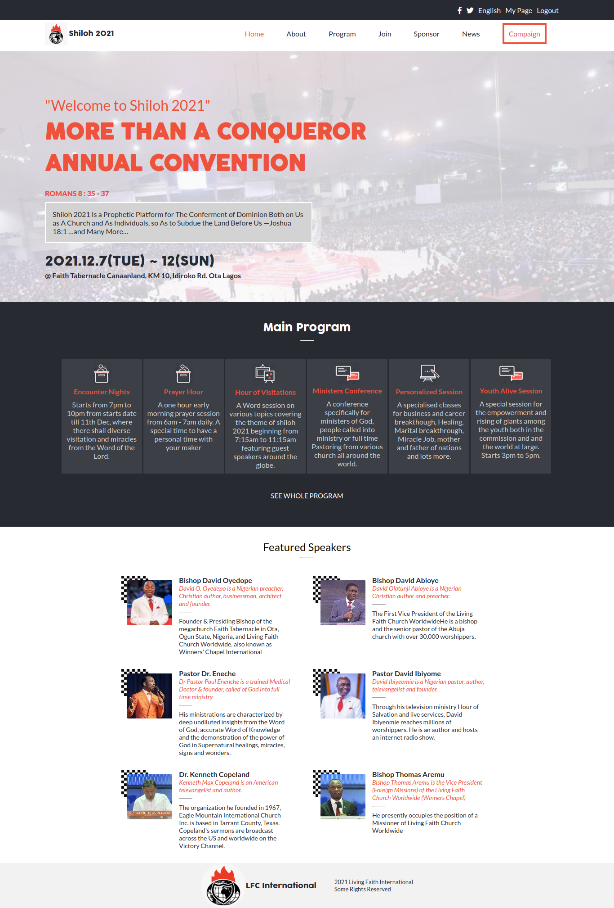
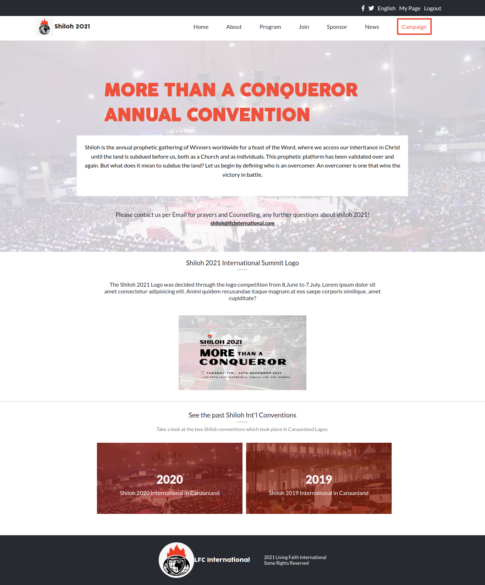
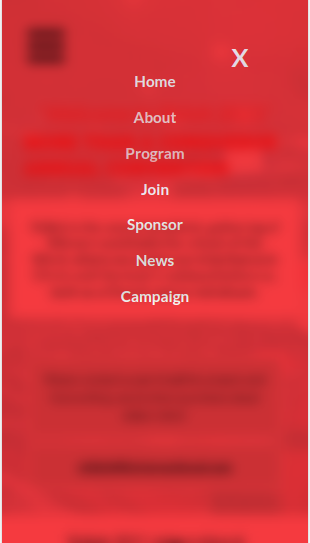

# Shiloh 2021 Annual Convention: More than a conqueror

A web page for the annual Living Faith Church Worldwide convention, @ Faith Tabernacle Canaanland, KM 10, Idiroko Rd. Ota Lagos uses the creative design on Behance. Built using JavaScript, HTML, CSS.

## Built With

- HTML
- CSS
- JavaScript

## Visit my Portfolio

[Live Here](https://netman5.github.io/capstone/)

## Getting Started

To get a local copy up and running follow these simple example steps.

### Prerequisites

clone repo: `git clone https://github.com/netman5/capstone.git`

then
`cd capstone`

### Install

run `npm install` to install dependencies

## Authors

👤 **Author**

- GitHub: [@netman5](https://github.com/netman5)
- Twitter: [@Orlaish](https://twitter.com/Orlaish)
- LinkedIn: [LinkedIn](https://www.linkedin.com/in/ola-ishola/)

## 🤝 Contributing

Contributions, issues, and feature requests are welcome!

Feel free to check the [issues page](../../issues/).

## Show your support

Give a ⭐️ if you like this project!

## Acknowledgments

- Hat tip to anyone whose code was used
- Inspiration
- etc

## Credits

For this project design, the original design idea is by Cindy Shin in Behance.

- Behance: [Cindy Shin](https://www.behance.net/gallery/29845175/CC-Global-Summit-2015)

## 📝 License

This project is [MIT](./MIT.md) licensed.
